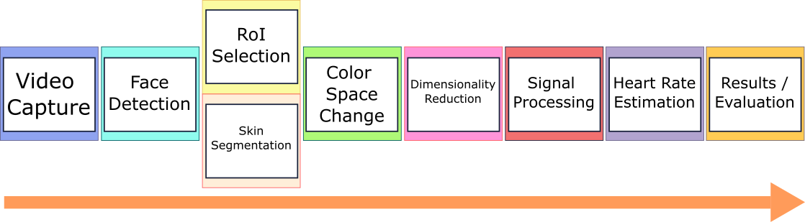

# **An Image-Processing Toolkit for Remote Photoplethysmography.**

  
   
  
 

This is a library that includes different modules to more easily perform some of the usual preprocessing steps in remote photoplethysmography, like face detection, changes in color space, skin detection, region of interest selection among others. Modules include some algorithms that use deep learning, using the tensorflow library.

**Code will be uploaded when the letter associated to this work is published. The toolkit will be available to install using pip.**

## **Currently implemented modules**

  

### **Face detection**
As of now, five different face detection modules have been implemented:

* **Deepface** A module that encapsulates the face detection capabilities of the Deepface library, which includes different face detectors: based on haar cascades, a deep learning classifier based on ssd, one based on dlib, one using mtcnn and at last one using retinaface. At the end of this readme, there is a comparison in performane and accuracy for the different models obtained using our internal dataset.

* **Yolo V3** A module that encapsulates a version of the YoloV3 algorithm. It runs on CPU.
* **Viola-Jones** A module that encapsulates an implementation of the Viola-Jone algorithms. Runs on CPU.

* **SSD with mobilenet V2 backbone** Detector with an ssd mobilenetv2 backbone.

* **RetinaFace** Module for face detection using a different implementation of the retinaface model.

### **Skin segmentation**
For skin segmentation, we have implemented three different modules.

* **U-Net Skin Segmentation** A model that uses a U-Net semantic segmentation network, trained using the ABD-Skin segmentation dataset.
* **Color based skin segmentation** Using thresholds in different color spaces. While this performs faster than the deep learning one, it is less robust when applied over darker skin tonalities, so we recommend using the other segmentation module for more generic results.
* **DeepLabV3** A DeepLabV3 model trained using the ABD-Skin segmentation dataset.

### **Region of Interest selection**

* **Forehead** This block selects the forehead of the detected face as the RoI.
* **Cheeks** This block selects the cheeks of the detected face as the RoI.
* **Forehead and Cheeks** This block selects both forehead and cheeks of the detected face as the RoI.
* **Under eyes** This block selects a region under both eyes of the detected face as the RoI.
* **Custom** This block receives a custom region to select from the detected face as the RoI.

### **Color Space modules**

Algorithms may be applied over different color spaces with varying performance. Different blocks to quickly change the working color space have been implemented. As of now, there are blocks to change from and to the following color spaces:

* RGB
* BGR
* HSV
* YCbCr
* CIELab

### **Signal Processing Modules**

* **Color Average Module** Obtains color averages for the different channels of the video signal.

* **ICA** Performs ICA over the color averages for each channel. 

* **Illumination Balance Block** Block that receives the negative mask for a face detection/skin segmentation, as well as the masked region, and compensates ilumination changes of the *positive* region using the color variation in the background during the video.

### **Heart Rate Estimation modules**

Two different modules for heart rate estimation are currently implemented, one based on frequency analysis  and another one based on peak finding.

* **Frequency based** Uses the welch method to find the most prevalent frequency, in the 0.4-4Hz band (which is the range of "normal" heart rates).

* **Peak Finding** Estimates Heart Rate by using the times between signal peaks.

### **Results Display module**

A module implemented to display results obtained from the algorithm. It is subdivided into four different plots, with each displaying different information. First, a frame of the video is displayed to ensure the correct video is being processed, then, ground truth information and the obtained estimations are displayed on a graph. Another block is reserved to display information about the video (Name, duration, fps...), and a fourth plot is reserved so user can plot additional information that may be obtained from one of the intermediate steps (for example, a debug graph)

## **Dataset Loaders**
Currently, we include a loader for the COHFACE dataset, and a generic dataset loader in case you want to use your own videos.

## **Future Work**
This library will be updated with new state-of-the-art blocks for the currently implemented tasks, or for new tasks, as research in this field progresses.

We will also add direct support for more rPPG datasets.

### Canonical Block Order

  

The figure above represents the canonical block order, although you can combine them in any order (be careful with input signal format!)

## **Requirements**

### **Required packages**
The library was developed and tested in python 3.6.13, and the packages used were:

(check requirements.txt)

From pip:
* tensorflow-gpu==2.2.0 
* opencv-python
* opencv-contrib-python
* matplotlib

* scipy
* cmake
* dlib
* pyyaml
* keras==2.3.1
* scikit-image
* h5py==2.10.0
* pandas
* natsort
* numpy
* scikit-learn
* scikit-image
* deepface==0.0.53

Install packages (conda):
* cudatoolkit=10.1
* cudnn=7.6.5

### **Hardware requirements**

Tests were performed on a computer equipped with an Nvidia 1660Ti Q-Max (6GB VRAM), and a Ryzen 4800H CPU, with 16gb of RAM. Most models should run with 2GB VRAM.

In case you run out of vram, you can try running models with:

> tf.config.experimental.set_memory_growth(tf.config.experimental.list_physical_devices('GPU')[0], True)

Developed using Pop Os! 21.04, some modules may not work on Windows.

## **References**

List of articles used at some point during the development of this library:

[**1**]  M.  Abadi,  A.  Agarwal,  P.  Barham,  E.  Brevdo,  Z.  Chen,C. Citro, G. S. Corrado, A. Davis, J. Dean, M. Devin, S. Ghe-mawat, I. Goodfellow, A. Harp, G. Irving, M. Isard, Y. Jia,R. Jozefowicz, L. Kaiser, M. Kudlur, J. Levenberg, D. Man ́e,R.  Monga,  S.  Moore,  D.  Murray,  C.  Olah,  M.  Schuster,J.  Shlens,  B.  Steiner,  I.  Sutskever,  K.  Talwar,  P.  Tucker,V. Vanhoucke, V. Vasudevan, F. Vi ́egas, O. Vinyals, P. War-den, M. Wattenberg, M. Wicke, Y. Yu, and X. Zheng. Tensor-Flow:  Large-scale machine learning on heterogeneous sys-tems, 2015. Software available from tensorflow.org

[**2**]  Z. H. Al-Tairi, R. Rahmat, M. I. Saripan, and P. S. Sulaiman.Skin segmentation using yuv and rgb color spaces.J. Inf.Process. Syst., 10:283–299, 2014. 2

[**3**]  M.  Arsalan,  D.  S.  Kim,  M.  Owais,  and  K.  R.  Park.    Or-skip-net:  Outer residual skip network for skin segmentationin non-ideal situations.Expert Systems with Applications,141:112922, 2020. 2

[**4**]  B. Babenko, M.-H. Yang, and S. Belongie.  Visual trackingwith online multiple instance learning.  In2009 IEEE Con-ference on computer vision and Pattern Recognition, pages983–990. IEEE, 2009. 2

[**5**]  G. Balakrishnan, F. Durand, and J. Guttag.  Detecting pulsefrom  head  motions  in  video.   InProceedings  of  the  IEEEConference  on  Computer  Vision  and  Pattern  Recognition,pages 3430–3437, 2013. 1

[**6**]  L. Bertinetto, J. Valmadre, J. F. Henriques, A. Vedaldi, andP. H. S. Torr.  Fully-convolutional siamese networks for ob-ject tracking, 2016. 2

[**7**]  D. S. Bolme, J. R. Beveridge, B. A. Draper, and Y. M. Lui.Visual object tracking using adaptive correlation filters.   In2010 IEEE computer society conference on computer visionand pattern recognition, pages 2544–2550. IEEE, 2010. 2[**8**]  G. Bradski.   The OpenCV Library.Dr. Dobb’s Journal ofSoftware Tools, 2000. 3

[**9**]  S. Chaichulee, M. Villarroel, J. Jorge, C. Arteta, G. Green,K. McCormick, A. Zisserman, and L. Tarassenko. Multi-taskconvolutional neural network for patient detection and skinsegmentation in continuous non-contact vital sign monitor-ing.  In2017 12th IEEE International Conference on Auto-matic Face & Gesture Recognition (FG 2017), pages 266–272. IEEE, 2017. 2

[**10**]  D. Chen, G. Hua, F. Wen, and J. Sun. Supervised transformernetwork for efficient face detection. InEuropean Conferenceon Computer Vision, pages 122–138. Springer, 2016. 2

[**11**]  W. Chen and D. McDuff. Deepphys: Video-based physiolog-ical measurement using convolutional attention networks. InProceedings of the European Conference on Computer Vi-sion (ECCV), September 2018. 1

[**12**]  F. Chollet. keras. https://github.com/fchollet/keras, 2015. 2

[**13**]  D. Dahmani, M. Cheref, and S. Larabi.  Zero-sum game the-ory model for segmenting skin regions.Image and VisionComputing, 99:103925, 2020. 3

[**14**]  G.  De  Haan  and  V.  Jeanne.Robust  pulse  rate  fromchrominance-based rppg.IEEE Transactions on BiomedicalEngineering, 60(10):2878–2886, 2013. 1, 3

[**15**]  J. Deng, J. Guo, Y. Zhou, J. Yu, I. Kotsia, and S. Zafeiriou.Retinaface: Single-stage dense face localisation in the wild,2019. 2

[**16**]  A. Elgammal, C. Muang, and D. Hu.  Skin detection-a shorttutorial.Encyclopedia of Biometrics, 4:1218–1224, 2009. 2

[**17**]  H.  K.  Galoogahi,   A.  Fagg,   and  S.  Lucey.Learningbackground-aware  correlation  filters  for  visual  tracking,2017. 2

[**18**]  R. Girshick, J. Donahue, T. Darrell, and J. Malik.  Rich fea-ture hierarchies for accurate object detection and semanticsegmentation, 2014.

[**19**]  H. Grabner, M. Grabner, and H. Bischof. Real-time trackingvia on-line boosting.  InBmvc, volume 1, page 6. Citeseer,2006. 2

[**20**]  K. He, G. Gkioxari, P. Doll ́ar, and R. Girshick.  Mask r-cnn,2018. 2

[**21**]  J. F. Henriques, R. Caseiro, P. Martins, and J. Batista.  High-speed  tracking  with  kernelized  correlation  filters.IEEEtransactions  on  pattern  analysis  and  machine  intelligence,37(3):583–596, 2014. 2

[**22**]  J.  Hernandez-Ortega,  J.  Fierrez,  A.  Morales,  and  D.  Diaz.A comparative evaluation of heart rate estimation methods using face videos.   In2020 IEEE 44th Annual Computers,Software, and Applications Conference (COMPSAC), pages1438–1443. IEEE, 2020. 1

[**23**]  K.-Y.Huang.retinaface-tf2.https://github.com/peteryuX/retinaface-tf2, 2020. 3

[**24**]  Y. Jang, H. Gunes, and I. Patras.  Registration-free face-ssd:Single  shot  analysis  of  smiles,  facial  attributes,  and  affectin  the  wild.Computer  Vision  and  Image  Understanding,182:17–29, May 2019. 2

[**25**]  H.  Jiang  and  E.  Learned-Miller.    Face  detection  with  thefaster r-cnn.   In2017 12th IEEE International Conferenceon Automatic Face & Gesture Recognition (FG 2017), pages650–657. IEEE, 2017. 2

[**26**]  R. Khan, A. Hanbury, and J. Stoettinger.  Skin detection:  Arandom forest approach.  In2010 IEEE International Con-ference on Image Processing, pages 4613–4616, 2010. 2

[**27**]  G. Lempe, S. Zaunseder, T. Wirthgen, S. Zipser, and H. Mal-berg.Roi  selection  for  remote  photoplethysmography.InBildverarbeitung  f ̈ur  die  Medizin  2013,  pages  99–103.Springer, 2013. 1, 3

[**28**]  B.  Li,  W.  Wu,  Q.  Wang,  F.  Zhang,  J.  Xing,  and  J.  Yan.Siamrpn++:  Evolution of siamese visual tracking with verydeep networks, 2018. 2

[**29**]  B.  Li,  J.  Yan,  W.  Wu,  Z.  Zhu,  and  X.  Hu.   High  perfor-mance visual tracking with siamese region proposal network.InProceedings of the IEEE Conference on Computer Visionand Pattern Recognition (CVPR), June 2018. 2

[**30**]  X. Li, J. Chen, G. Zhao, and M. Pietikainen.  Remote heartrate measurement from face videos under realistic situations.InProceedings of the IEEE Conference on Computer Visionand Pattern Recognition (CVPR), June 2014. 3

[**31**]  S.  Liu,  D.  Liu,  G.  Srivastava,  D.  Połap,  and  M.  Wo ́zniak.Overview and methods of correlation filter algorithms in ob-ject tracking.Complex & Intelligent Systems, pages 1–23,2020. 2

[**32**]  W. Liu,  D. Anguelov,  D. Erhan,  C. Szegedy,  S. Reed,  C.-Y. Fu, and A. C. Berg.  Ssd:  Single shot multibox detector.Lecture Notes in Computer Science, page 21–37, 2016. 2

[**33**]  A.  Paszke,   S.  Gross,   F.  Massa,   A.  Lerer,   J.  Bradbury,G.  Chanan,  T.  Killeen,  Z.  Lin,  N.  Gimelshein,  L.  Antiga,A.  Desmaison,  A.  Kopf,  E.  Yang,  Z.  DeVito,  M.  Raison,A. Tejani, S. Chilamkurthy, B. Steiner, L. Fang, J. Bai, andS. Chintala. Pytorch: An imperative style, high-performancedeep  learning  library.In  H.  Wallach,   H.  Larochelle,A. Beygelzimer, F. d'Alch ́e-Buc, E. Fox, and R. Garnett, edi-tors,Advances in Neural Information Processing Systems 32,pages 8024–8035. Curran Associates, Inc., 2019

[**34**]  F.  Pedregosa,   G.  Varoquaux,   A.  Gramfort,   V.  Michel,B. Thirion, O. Grisel, M. Blondel, P. Prettenhofer, R. Weiss,V.  Dubourg,   J.  Vanderplas,   A.  Passos,   D.  Cournapeau,M. Brucher, M. Perrot, and E. Duchesnay. Scikit-learn: Ma-chine learning in Python.Journal of Machine Learning Re-search, 12:2825–2830, 2011. 3

[**35**]  M.-Z. Poh, D. J. McDuff, and R. W. Picard.  Advancementsin noncontact,  multiparameter physiological measurementsusing a webcam.IEEE Transactions on Biomedical Engi-neering, 58(1):7–11, 2011. 1, 3

[**36**]  J. Redmon,  S. Divvala,  R. Girshick,  and A. Farhadi.   Youonly look once: Unified, real-time object detection, 2016. 2

[**37**]  J. Redmon and A. Farhadi. Yolov3: An incremental improve-ment, 2018. 2

[**38**]  M. Sandler, A. Howard, M. Zhu, A. Zhmoginov, and L.-C.Chen.    Mobilenetv2:   Inverted  residuals  and  linear  bottle-necks, 2019. 3

[**39**]  N.  Sebe,  I.  Cohen,  T.  S.  Huang,  and  T.  Gevers.   Skin  de-tection: A bayesian network approach. InProceedings of the17th International Conference on Pattern Recognition, 2004.ICPR 2004., volume 2, pages 903–906. IEEE, 2004. 2

[**40**]  S. I. Serengil and A. Ozpinar. Lightface: A hybrid deep facerecognition framework.   In2020 Innovations in IntelligentSystems and Applications Conference (ASYU), pages 23–27.IEEE, 2020. 2, 3

[**41**]  A. Topiwala, L. Al-Zogbi, T. Fleiter, and A. Krieger.  Adap-tation and Evaluation of Deep Leaning Techniques for SkinSegmentation on Novel Abdominal Dataset.  In2019 IEEE19th  International  Conference  on  Bioinformatics  and  Bio-engineering (BIBE), pages 752–759. IEEE, 2019. 2, 3

[**42**]  W. Verkruysse, L. O. Svaasand, and J. S. Nelson.   Remoteplethysmographic imaging using ambient light.Optics ex-press, 16(26):21434–21445, 2008. 1

[**43**]  P. Viola and M. Jones. Rapid object detection using a boostedcascade of simple features. InProceedings of the 2001 IEEEcomputer society conference on computer vision and patternrecognition. CVPR 2001, volume 1, pages I–I. IEEE, 2001.1, 2, 3

[**44**]  P.   Virtanen,   R.   Gommers,   T.   E.   Oliphant,   M.   Haber-land,  T.  Reddy,  D.  Cournapeau,  E.  Burovski,  P.  Peterson,W. Weckesser, J. Bright, S. J. van der Walt, M. Brett, J. Wil-son, K. J. Millman, N. Mayorov, A. R. J. Nelson, E. Jones,R.  Kern,  E.  Larson,  C.  J.  Carey, ̇I.  Polat,  Y.  Feng,  E.  W.Moore, J. VanderPlas, D. Laxalde, J. Perktold, R. Cimrman,I. Henriksen, E. A. Quintero, C. R. Harris, A. M. Archibald,A. H. Ribeiro, F. Pedregosa, P. van Mulbregt, and SciPy 1.0Contributors.  SciPy 1.0:  Fundamental Algorithms for Sci-entific Computing in Python.Nature Methods, 17:261–272,2020. 4

[**45**]  P. Voigtlaender, J. Luiten, P. H. S. Torr, and B. Leibe.  Siamr-cnn: Visual tracking by re-detection, 2020. 2

[**46**]  wanjinchang.deepface-1.https://github.com/wanjinchang/deepface-1, 2019. 3

[**47**]  B. Yan, H. Peng, J. Fu, D. Wang, and H. Lu. Learning spatio-temporal transformer for visual tracking, 2021. 2

[**48**]  Y. Yang, C. Liu, H. Yu, D. Shao, F. Tsow, and N. Tao. Motionrobust remote photoplethysmography in cielab color space.Journal of biomedical optics, 21(11):117001, 2016.

[**49**]  C. Zhang, X. Xu, and D. Tu.  Face detection using improvedfaster rcnn, 2018. 2

[**50**]  K. Zhang, Z. Zhang, Z. Li, and Y. Qiao.  Joint face detectionand alignment using multitask cascaded convolutional net-works.IEEE Signal Processing Letters, 23(10):1499–1503,Oct 2016.

## **Acknowledgements**
This library was developed under a scholarship for the promotion of research from the Universidad Autónoma de Madrid.

## **Annex**

### Different deepface backends comparison:

| Backend | Miss Rate (%) | Detection time(ms) | 
| --------|-----------|----------------|
| opencv  |   3.037   |     28.61    | 
|   ssd   |   3.52    |     18.9       |
| dlib | 0.0 | 650*|
| mtcnn | 0.0 | 474 | 
| retinaface | 0.0  | 999.23**  | 

Miss rate measures the percentage of frames with a face where the algorithm failed to detect it.

Detection times are averaged over all detection times for all frames in the dataset.

Test were performed on the previously mentioned system.

*Runs on cpu

**Probably due to GPU not having enough memory to run it properly.
